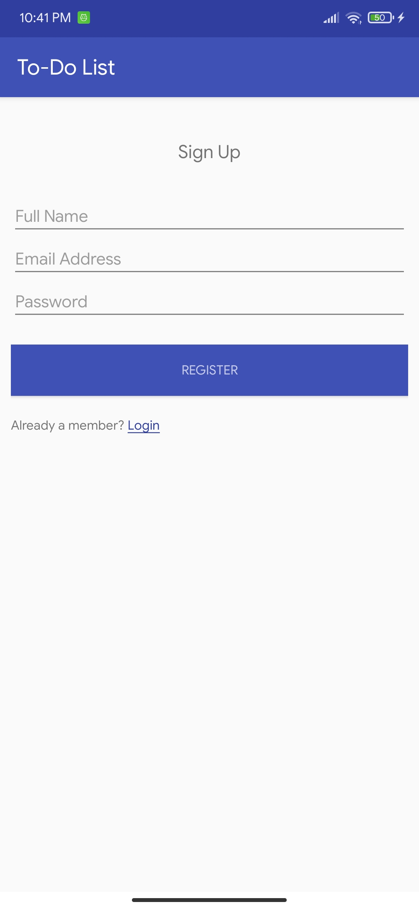
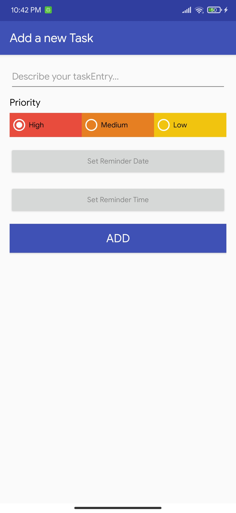
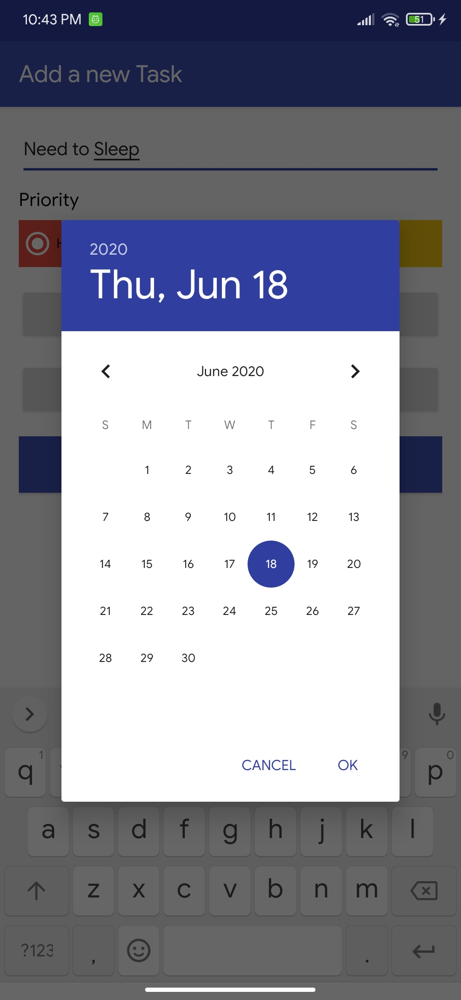
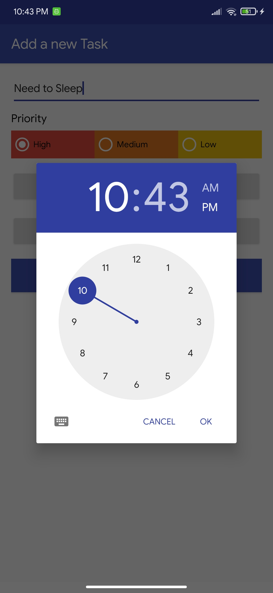
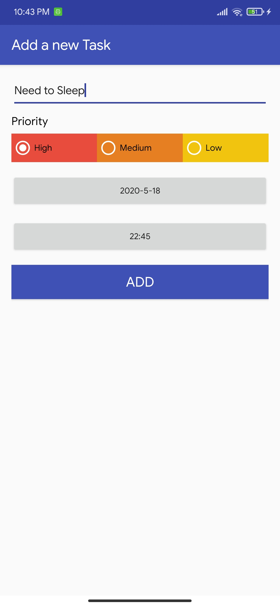
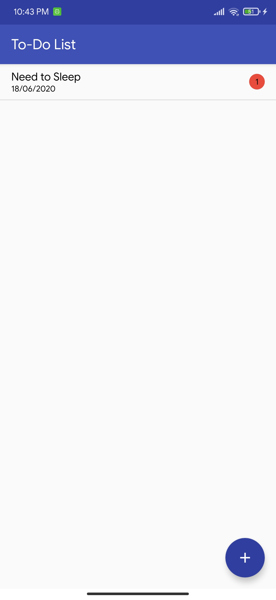
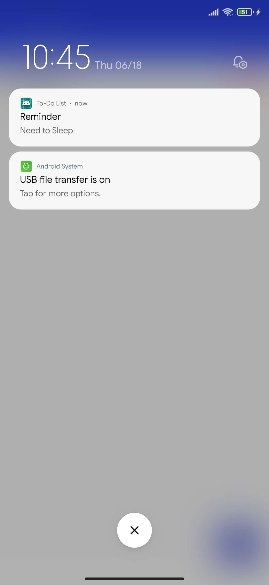

# Developing Mobile Application
## Todo-List Application
---
### Features
* User Login and Registration
* Add notes for particular logged in user
* Add notification reminder for todo in particular date and time
* Edit the Todo created
* Swipe to delete the Todo created
---
### User Guide
* User Registration:  
The user can register by clicking the sign up link. The user should provide with name, email and password

* User Login:  
The user after creation of account can login using their email address and their password

* Adding todo list:  
The user can press the add floating button inorder to create a todo list. Here, the user can provide the description, priority and can also set the reminder by setting the date and time.

* Viewing Todo List:  
The added todo is shown in the main page as a list of todo where users can view the todo

* Editing todo list:  
The user can edit the todo by tapping on the todo from the list in the main page.
* Deleting todo list:  
The user can delete the tody by swiping the todo from the list left or right.
* Notification:  
If the notification reminder is set for the todo, then, the user is notified on specified date and time as android notification.

